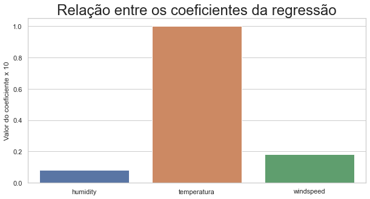

# PROJETO FINAL - IRONHACK

### OBJETIVOS 

Entender os efeitos climáticos em provas de atletismos, mas especificamente nas provas de 100 metros rasos masculina. O principal objetivo é encontrar um modelo que faça uma previsão dos resultados médios das provas e chegar a algumas conclusões sobre esses efeitos. 

### Motivação

Como amante da corrida e corredor, quero entender como essas varáveis impactam  em atletas de alta performance. 

## ESTUDO E MÉTODOLOGIA

Como não havia um *data set* pronto, foi necessário recorrer ao site da organização mundial de atletismo https://www.worldathletics.org/  e fazer *scrapping* de suas páginas para trazer todas as provas  para atletas profissionais. Além disso, foi necessário usar a api da VisualCrossing   https://www.visualcrossing.com/weather-api para trazer as informações climáticas das cidades nos dias de prova. E por fim, correlaciona-lá e gerar a seguinte base:

Nesse repositório é possivel encontrar o [script](criacao_base.sql) de criação da base de dados nesse mesmo repositório.  Para popular a base use o notebook [atualizacao_base](atualizacao_base.ipynb). Este contém toda a lógica do *scrapping.*  O esquema abaixo, resume essa extração:

A dados das provas de 100 metros foram disponibilizados também no [kaggle](https://www.kaggle.com/datasets/andremarcelonunes/100meters) 

Para esse estudo, os primeiros 5 colocados foram agrupados por prova e calculado o resultado médio da prova, resultando num *data set* de 6900 linhas. 

O que queremos prever é o resultado médio através de uma regressão.  Contudo, foi necessário limpar os dados,  criar algumas *features* (tentativas)  e avaliar a relevância estatística de cada variável independente e colocar nos modelos, avaliando seus respectivos RMSE. 

## ANÁLISE E RESULTADOS

As variáveis estatisticamente  relevantes para a regressão foram a temperatura, umidade e velocidade do vento e  aqui está relação entre elas:

Logo, a temperatura se mostrou mais relevante que as demais, seu impacto é 5 vezes maior em relação a velocidade do vento e 10 vezes em relação a umidade. 

Implementando o modelo de regressão com a Catboost.

O RMSE da previsão foi 0,26 segundos. O desvio padrão da previsão foi 0,055 segundos, e desvio padrão dos resultados foi 0,26, portanto o modelo não conseguiu prever 0,20 segundos dos resultados. Observando o desvio padrão, o modelo conseguiu prever somente 0,055, ou seja cerca de 5,5 décimos, não parece muito pouco, mas os recordes são decididos exatamente nessa casa

 Vejamos os campeonatos  campeonatos mundiais entre 1983 e 2009: 

Perceba na imagem acima que entre 1991 e 1993, Linfor Chistie não bateu o record de Lewis por 0,02 decimos! 

### Agora, vamos às variáveis climáticas

A temperatura, como impacta? 

Observamos que corredores tem melhor performance entre 15 e 25 graus. Se houver alguém tão bom quanto o Usain Bolt, eu poderia arriscar  que quebraria o record num lindo dia de primavera. 

A  Umidade, como impacta? 

Corredores tem melhor performance por volta dos 70% de umidade. Se houver alguém tão bom  quanto o Usain Bolt, eu poderia arriscar  que quebraria o record nessa condição. 

A velocidade do vento , como impacta? 

Impacta bem, tanto que  é bem controlado pela Organização mundial de Atletismo, no máximo 2 m/s contra ou a  favor para considerar-se um record. Esse é vento do *data set* foi aferido na cidade, não especificamente na prova. 

As provas melhores aconteceram com ventos entre 20  e 30km/h. Nesse quesito, com vento, todo santo ajuda

Existem muitos fatores que contribuem para o resultado da prova: genéticos, periodização do treinamento, tempo de reação, etc.  O tempo médio em provas de atletas de performance são muito parecidos. Logo, não é possível afirmar que um atleta  correrá mais rápido só por que aumentou a temperatura. Alias, afirmar algo em uma prova antes de acontecer é bem complexo, principalmente em provas de atletismo. 

Isto posto,  esses são os parâmetros climáticos  para arriscar o resultado de uma prova,  todo décimo conta. 

## Saídas

https://www.kaggle.com/andremarcelonunes/100meters

